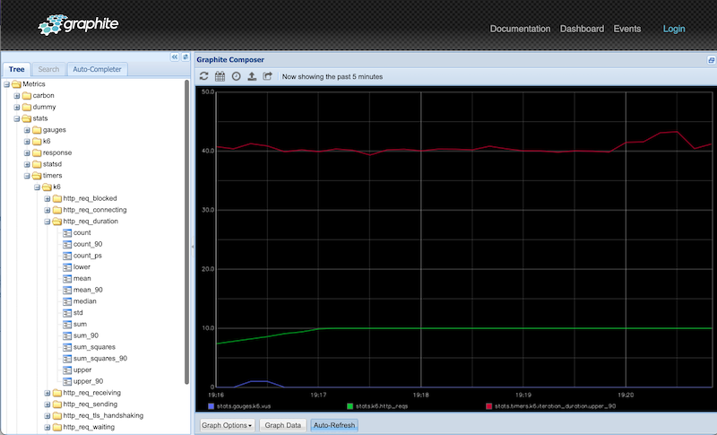

# xk6-output-statsd
Provides support for real-time output of k6 test metrics to a [StatsD](https://github.com/statsd/statsd) service.

Direct support for the _StatsD_ metrics collector will be removed from k6 in a future release.
For those seeking to continue using StatsD, the functionality may be compiled into custom k6 binaries as an [xk6 extension](https://k6.io/docs/extensions/).

## Build

To build a `k6` binary with this extension, first ensure you have the prerequisites:

- [Go toolchain](https://go101.org/article/go-toolchain.html)
- Git
- [xk6](https://github.com/grafana/xk6)

1. Build with `xk6`:

```bash
xk6 build --with github.com/javaducky/xk6-output-statsd
```

This will result in a `k6` binary in the current directory.

2. Run with the just build `k6:

```bash
./k6 run -o output-statsd <script.js>
```

## Options
The `xk6-output-statsd` extension supports the following configuration options:

| Environment Variable | Default         | Description                                                                           |
|----------------------|-----------------|---------------------------------------------------------------------------------------|
| K6_STATSD_ADDR       | `localhost:8125` | Address of the statsd service, currently only UDP is supported.                       |
| K6_STATSD_NAMESPACE  | `k6.`           | The namespace used as a prefix for all the metric names.                              |
| K6_STATSD_PUSH_INTERVAL | `1s`            | Configure how often data batches are sent.                                            |
| K6_STATSD_BUFFER_SIZE | `20`            | The buffer size.                                                                      |
| K6_STATSD_ENABLE_TAGS | `false`         | If `true` enables sending tags. Versions prior to statsd v0.9.0 did not support tags. |
| K6_STATSD_TAG_BLOCKLIST | `vu,iter,url`   | Comma-separated list of tags that should not be sent to statsd.                       |

Options may be specified as system environment variables as with the following:

```bash
K6_STATSD_ADDR=localhost:8125 K6_STATSD_ENABLE_TAGS=true ./k6 run -o output-statsd examples/simple.js
```

# Testing Locally

This repository includes a [docker-compose.yml](./docker-compose.yml) file that starts Graphite backed by StatsD which can be used for testing the `xk6-output-statsd` extension. 

> :warning: This environment is intended for testing only and should not be used for production purposes.

1. Start the docker compose environment.
   ```bash
   docker compose up -d
   ```
   Output should appear similar to the following:
   ```shell
   ✔ Network xk6-output-statsd_default       Created               ...    0.0s
   ✔ Container xk6-output-statsd-graphite-1  Started               ...    0.3s
   ```
2. Use your [custom k6 binary](#build) to run a k6 test script sending metrics to your StatsD service started ing the previous step. 
   ```bash
   ./k6 run -o output-statsd examples/ramping-vus.js
   ```
3. Open the Graphite application by accessing [http://localhost:80/](http://localhost/?showTarget=stats.timers.k6.http_req_duration.count&showTarget=stats.timers.k6.http_req_duration.count&from=-5minutes&target=stats.gauges.k6.vus&target=stats.k6.http_reqs&target=stats.timers.k6.iteration_duration.upper_90) to view metrics from your test similar to the following:
   